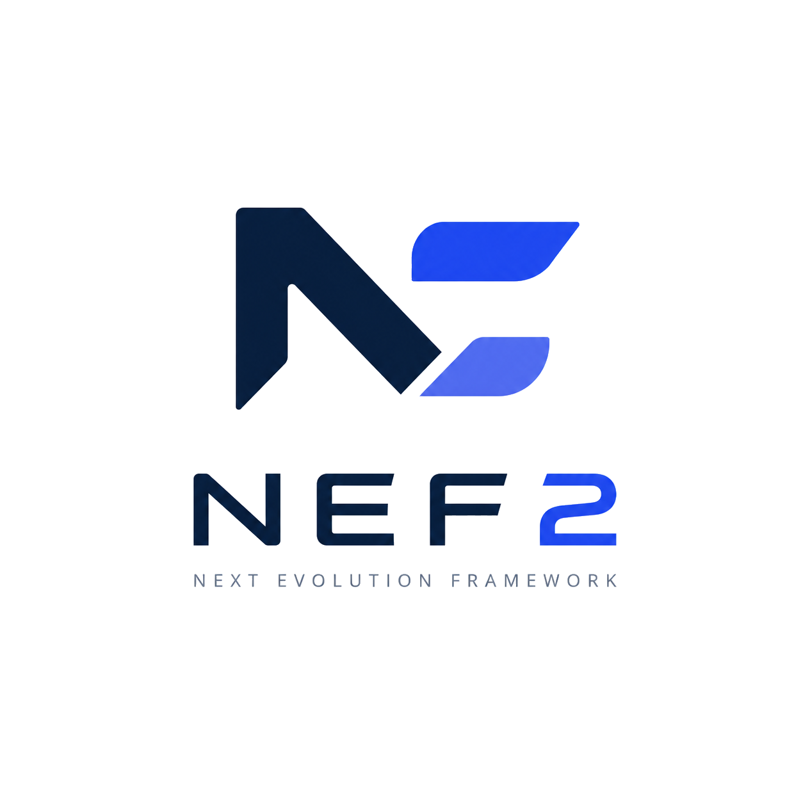

<div align="center">
  
  <h1>NEF2: The AI Operating Infrastructure</h1>
  <p><strong>A hardware-native, unified multi-backend intelligence stack for distributed AI execution.</strong></p>

  <div>
    <a href="https://pypi.org/project/nef2/"></a>
    <a href="https://github.com/Hexa08/NEF2/blob/main/LICENSE"></a>
    <a href="https://github.com/Hexa08/NEF2/actions"></a>
    <a href="#hardware-native-stack"></a>
  </div>
</div>

---

## NEF2: The AI Operating Substrate

**A hardware-native, framework-independent intelligence stack for the next generation of autonomous systems.**

---

## The Vision

NEF2 is not a library; it is a **Substrate**. It eliminates the "framework tax" by bypassing heavy abstractions like PyTorch and JAX, communicating directly with the silicon through a custom-built hardware-native stack.

It is designed for a world where AI is not just a model, but a distributed, agentic system requiring zero-copy memory movement, hardware-peak performance, and intelligent memory virtualization.

## Key Pillars

- **Zero-Dependency Core**: Pure Python/C++/Rust. No external ML frameworks.
- **Hardware-Native Stack (NEF-HNS)**: Direct NVIDIA Driver API integration using raw PTX assembly.
- **HyperCache Memory**: Transparent virtualization of VRAM across System RAM and NVMe for trillion-parameter scale.
- **Agent-Native Primitives**: Built-in support for model-chaining, shared tensor buses, and streaming inference.

---

## Feature Matrix

| Feature | Status | Technology |
| :--- | :--- | :--- |
| **NEFCore Runtime** | ✅ Production | Hybrid C++/Rust/Python execution |
| **CUDA Driver Backend** | ✅ Production | Raw PTX Kernel execution |
| **HyperCache (VRAM/RAM)** | 🚧 Beta | Intelligent memory paging |
| **TurboQuant** | 🚧 Beta | Adaptive precision (FP8, INT4, NF4) |
| **Multi-GPU Fabric** | ✅ Active | Unified logical accelerator |
| **NEF Compiler** | ✅ Active | Graph capture & kernel fusion |

---

## Documentation Suite

For deep dives into specific areas of the NEF2 ecosystem:

*   **[Getting Started](./docs/GETTING_STARTED.md)**: Installation, your first model, and basic training.
*   **[Architecture Deep-Dive](./docs/ARCHITECTURE.md)**: Understanding NEFCore, HyperCache, and the Compiler stack.
*   **[Hardware Support](./docs/HARDWARE.md)**: Details on CUDA, HIP, Metal, and NPU integration.
*   **[Developer Guide](./docs/DEVELOPER.md)**: Contributing, coding standards, and kernel development.

---

## Quick Start

### Installation

```bash
# Standard install (CPU & Core logic)
pip install nef2

# For GPU-accelerated wheels (CUDA 12.1+):
pip install nef2 --extra-index-url https://Hexa08.github.io/whl/
```

### Hardware-Native Tensors

```python
from nef2 import Tensor
import nef2.gpu as gpu

# NEF2 automatically handles device placement
x = Tensor([[1, 2], [3, 4]], requires_grad=True)

if gpu.cuda_available():
    # Direct hardware-native matmul
    a, b = gpu.tensor([[1.0, 2.0]]), gpu.tensor([[3.0], [4.0]])
    c = a.matmul(b)
    print(f"Result on {gpu.device_name()}: {c.tolist()}")
```

---

## Roadmap

1.  **Phase 1 (Active)**: Establish the Foundation with NEFCore and custom CUDA kernels.
2.  **Phase 2 (Active)**: Implement the Rust-based safe concurrency layer and distributed networking.
3.  **Phase 3 (Active)**: Launch the HyperScale Multi-GPU Fabric for unified cluster execution.
4.  **Phase 4 (Active)**: Realize Agent-Native Infrastructure for autonomous, model-agnostic intelligence.

---

<div align="center">
  <p>Built for the future of <strong>Distributed Intelligence</strong>.</p>
  <p>Join the revolution at <a href="https://github.com/Hexa08/NEF2">github.com/Hexa08/NEF2</a></p>
</div>
