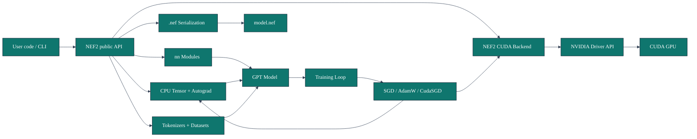
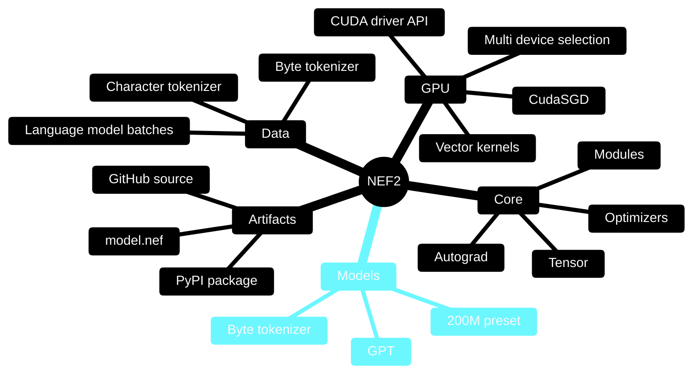
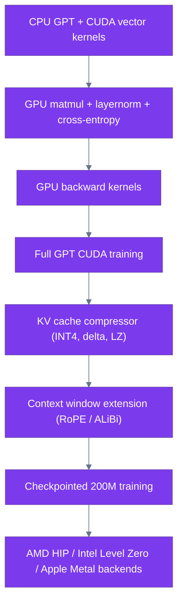

<div align="center">

# NEF2

**A small neural-network and LLM framework with a pure-Python CPU core and a NEF2-owned CUDA driver backend.**

[](https://pypi.org/project/nef2/)
[](https://pypi.org/project/nef2/)
[](LICENSE)
[](#design-principles)
[](#cuda-backend)

`pip install nef2`

</div>

## Overview

NEF2 is an experimental framework for learning and building neural-network
systems from first principles. It includes a readable CPU autograd engine, a
small PyTorch-shaped neural-network API, a compact GPT-style model, Wikipedia
dataset tooling, `.nef` model serialization, and a CUDA backend that talks
directly to NVIDIA's driver API through Python's standard library.

The project intentionally avoids external ML frameworks. The CUDA path does not
use PyTorch, TensorFlow, CuPy, JAX, or the Hugging Face `datasets` package.

## Install

```bash
pip install nef2
```

Browse the source:

```bash
git clone https://github.com/Hexa08/NEF2.git
cd NEF2
```

## Quick Start

```python
from nef2 import Tensor
from nef2.models import GPT, GPTConfig

model = GPT(GPTConfig(vocab_size=16, block_size=8, n_embd=8, n_layer=1, n_head=2))
logits = model(Tensor([[1, 2, 3, 4]]))

print(logits.shape)
```

## Feature Matrix

| Area | Status | Notes |
| --- | --- | --- |
| CPU tensors | Implemented | Python-list tensor storage with scalar/list shapes |
| Autograd | Implemented | Reverse-mode graph execution |
| Neural layers | Implemented | `Linear`, `Embedding`, `LayerNorm`, `Dropout`, `Sequential` |
| Optimizers | Implemented | `SGD`, `AdamW`, CUDA-backed `CudaSGD` with GPU caching |
| GPT model | Implemented on CPU | Compact causal Transformer with KV cache and matmul attention |
| KV cache | Implemented | Caches K/V across generation steps (O(n) per token) |
| `.nef` model files | Implemented | Compact binary format with integrity checks |
| NVIDIA CUDA backend | Implemented | Vector kernels + matmul + layernorm + cross-entropy, Linux + Windows |
| GPU layernorm | Implemented | PTX kernel, integrated into `nn.LayerNorm` |
| GPU cross-entropy | Implemented | PTX kernel with stable log-softmax |
| Vendor backend detection | Implemented | Auto-detects CUDA, HIP, Level Zero, Metal |
| AMD, Intel, Apple backends | Planned | Native kernels for HIP, Level Zero, Metal |
| Full GPU backward kernels | Planned | Dedicated backward kernels for matmul, layernorm |
| Context window extension | Planned | RoPE / ALiBi for >1024 tokens |

## Architecture



## Project Mindmap



## CUDA Backend

NEF2 includes a direct NVIDIA CUDA backend. It loads the CUDA driver (`nvcuda.dll` on
Windows, `libcuda.so.1` on Linux), creates a context, loads NEF2 PTX kernels,
allocates device memory, launches kernels, and copies results back.

```python
from nef2 import gpu

print(gpu.device_name())
print(gpu.list_devices())

a = gpu.tensor([1, 2, 3])
b = gpu.tensor([4, 5, 6])

print((a + b).tolist())
```

Choose a CUDA device:

```python
from nef2 import gpu

with gpu.use_device(0):
    x = gpu.tensor([1, 2, 3])
```

GPU matrix multiplication:

```python
from nef2 import gpu

a = gpu.tensor([[1.0, 2.0], [3.0, 4.0]])
b = gpu.tensor([[5.0, 6.0], [7.0, 8.0]])
c = a.matmul(b)
print(c.tolist())
```

Keep the GPU busy long enough to verify in `nvidia-smi`:

```bash
nef2-gpu-stress --seconds 60 --hold-seconds 10 --elements 50000000
```

Expected result:

```text
device=NVIDIA GeForce RTX 3050 Ti Laptop GPU
result=[3.0, 3.0, 3.0]
```

## Training

NEF2 does not bundle datasets. Bring your own text, tokenize it, and train:

```python
from nef2 import GPT, GPTConfig, Tensor, AdamW, cross_entropy, save_model
from nef2.data import make_lm_batch
from nef2.byte_tokenizer import ByteTokenizer

# Load any text you want
with open("my_text.txt", "rb") as f:
    text = f.read()

tokenizer = ByteTokenizer()
tokens = tokenizer.encode(text)

config = GPTConfig(
    vocab_size=tokenizer.vocab_size,
    block_size=256,
    n_embd=384,
    n_layer=6,
    n_head=6,
)
model = GPT(config)
opt = AdamW(model.parameters(), lr=3e-4)

for step in range(1000):
    xb, yb = make_lm_batch(tokens, batch_size=32, block_size=config.block_size)
    loss = cross_entropy(model(xb), yb)
    opt.zero_grad()
    loss.backward()
    opt.step()
    if step % 100 == 0:
        print(f"step {step}: loss = {loss.item():.4f}")

save_model(model, "model.nef")
```

## Design Principles

- Keep the CPU core dependency-free and readable.
- Make tensor, module, optimizer, and model APIs familiar to users of modern ML
  frameworks without importing those frameworks.
- Own the GPU path inside NEF2 instead of delegating training to PyTorch or CuPy.
- Be explicit about scope: implemented features should run; planned features
  should be labeled as planned.

## Package Layout

```text
nef2/
  tensor.py                 # Tensor storage and reverse-mode autograd
  nn.py                     # Module, Parameter, layers, cross entropy
  optim.py                  # SGD, AdamW, CudaSGD
  gpu.py                    # CUDA driver backend
  serialization.py          # .nef save/load helpers
  tokenizer.py              # Character tokenizer
  byte_tokenizer.py         # Byte tokenizer
  data.py                   # Language-model batching
  models/gpt.py             # Causal Transformer model
  models/presets.py         # 200M preset and parameter estimator
  cli/                      # GPU stress test command-line tool
```

## Roadmap



## Status

NEF2 is an alpha framework. It is suitable for experimentation, education,
framework development, and small-model tests. It is not yet a fast production
training stack for large LLMs.

NVIDIA CUDA is implemented for the current low-level backend. AMD, Intel, Apple,
Vulkan, OpenCL, HIP/ROCm, Metal, and Level Zero require separate backend
implementations. NEF2 reports unsupported backends clearly instead of pretending
unsupported GPUs are active.

## License

MIT. See [LICENSE](LICENSE).
