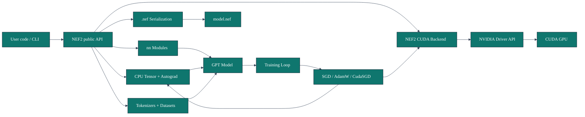
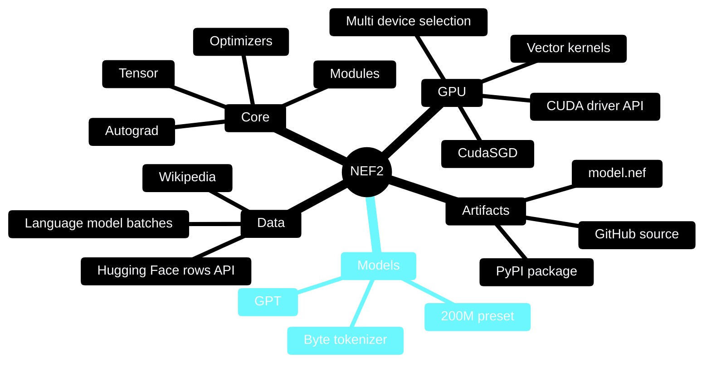
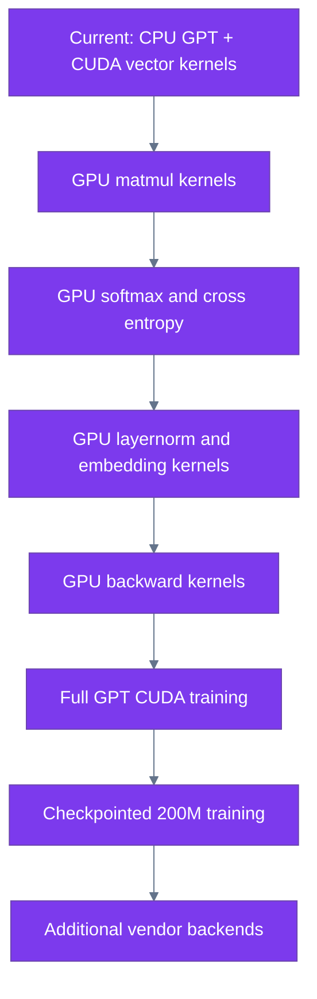

<div align="center">

# NEF2

**A small neural-network and LLM framework with a pure-Python CPU core and a NEF2-owned CUDA driver backend.**

[](https://pypi.org/project/nef2/)
[](https://pypi.org/project/nef2/)
[](LICENSE)
[](#design-principles)
[](#cuda-backend)

`pip install nef2`

</div>

## Overview

NEF2 is an experimental framework for learning and building neural-network
systems from first principles. It includes a readable CPU autograd engine, a
small PyTorch-shaped neural-network API, a compact GPT-style model, Wikipedia
dataset tooling, `.nef` model serialization, and a CUDA backend that talks
directly to NVIDIA's driver API through Python's standard library.

The project intentionally avoids external ML frameworks. The CUDA path does not
use PyTorch, TensorFlow, CuPy, JAX, or the Hugging Face `datasets` package.

## Install

```bash
pip install nef2
```

From source:

```bash
git clone https://github.com/Hexa08/NEF2.git
cd NEF2
pip install .
```

## Quick Start

```python
from nef2 import Tensor
from nef2.models import GPT, GPTConfig

model = GPT(GPTConfig(vocab_size=16, block_size=8, n_embd=8, n_layer=1, n_head=2))
logits = model(Tensor([[1, 2, 3, 4]]))

print(logits.shape)
```

## Feature Matrix

| Area | Status | Notes |
| --- | --- | --- |
| CPU tensors | Implemented | Python-list tensor storage with scalar/list shapes |
| Autograd | Implemented | Reverse-mode graph execution |
| Neural layers | Implemented | `Linear`, `Embedding`, `LayerNorm`, `Dropout`, `Sequential` |
| Optimizers | Implemented | `SGD`, `AdamW`, CUDA-backed `CudaSGD` bridge |
| GPT model | Implemented on CPU | Compact causal Transformer model |
| Wikipedia loader | Implemented | Uses Hugging Face dataset-server API with `urllib` |
| `.nef` model files | Implemented | JSON model parameter snapshots |
| NVIDIA CUDA backend | Implemented for vector kernels | Uses `nvcuda.dll` through `ctypes` |
| Full GPT CUDA training | In progress | Needs GPU matmul, attention, layernorm, loss, and backward kernels |
| AMD, Intel, Apple GPUs | Planned | Requires separate native vendor backends |

## Architecture



## Project Mindmap



## Training Flow

```mermaid
%%{init: {"theme": "base", "themeVariables": {"primaryColor": "#2563eb", "primaryTextColor": "#ffffff", "lineColor": "#475569", "secondaryColor": "#eff6ff"}}}%%
sequenceDiagram
    participant CLI as nef2-wikipedia-200m
    participant HF as Hugging Face dataset-server
    participant TOK as ByteTokenizer
    participant GPT as NEF2 GPT
    participant OPT as Optimizer
    participant FILE as model.nef

    CLI->>HF: Fetch Wikipedia rows
    HF-->>CLI: title, text
    CLI->>TOK: Encode UTF-8 bytes
    TOK-->>CLI: token ids
    CLI->>GPT: Forward pass
    GPT-->>CLI: logits
    CLI->>GPT: cross_entropy + backward
    CLI->>OPT: step()
    CLI->>FILE: save_model()
```

## CUDA Backend

NEF2 includes a direct NVIDIA CUDA backend. It loads `nvcuda.dll`, creates a CUDA
context, loads NEF2 PTX kernels, allocates device memory, launches kernels, and
copies results back.

```python
from nef2 import gpu

print(gpu.device_name())
print(gpu.list_devices())

a = gpu.tensor([1, 2, 3])
b = gpu.tensor([4, 5, 6])

print((a + b).tolist())
```

Choose a CUDA device:

```python
from nef2 import gpu

with gpu.use_device(0):
    x = gpu.tensor([1, 2, 3])
```

Keep the GPU busy long enough to verify in `nvidia-smi`:

```bash
nef2-gpu-stress --seconds 60 --hold-seconds 10 --elements 50000000
```

Expected result:

```text
device=NVIDIA GeForce RTX 3050 Ti Laptop GPU
result=[3.0, 3.0, 3.0]
```

## Wikipedia 200M Preset

NEF2 includes a Hugging Face Wikipedia loader that uses the public dataset-server
API through Python's standard library.

Create the 200M configuration without allocating the full pure-Python parameter
set:

```bash
nef2-wikipedia-200m --preset 200m --articles 8
```

The current 200M preset is:

| Setting | Value |
| --- | ---: |
| Parameters | `203,065,344` |
| Vocabulary | `256` byte tokens |
| Context length | `1024` |
| Layers | `16` |
| Hidden size | `1024` |
| Attention heads | `16` |

Run a tiny end-to-end smoke train on Wikipedia text:

```bash
nef2-wikipedia-200m --preset tiny --articles 4 --steps 50 --batch-size 1 --block-size 8
```

Save a `.nef` model file:

```bash
nef2-wikipedia-200m --preset tiny --articles 4 --steps 50 --save model.nef
```

## Design Principles

- Keep the CPU core dependency-free and readable.
- Make tensor, module, optimizer, and model APIs familiar to users of modern ML
  frameworks without importing those frameworks.
- Own the GPU path inside NEF2 instead of delegating training to PyTorch or CuPy.
- Be explicit about scope: implemented features should run; planned features
  should be labeled as planned.

## Package Layout

```text
nef2/
  tensor.py                 # Tensor storage and reverse-mode autograd
  nn.py                     # Module, Parameter, layers, cross entropy
  optim.py                  # SGD, AdamW, CudaSGD
  gpu.py                    # CUDA driver backend
  serialization.py          # .nef save/load helpers
  tokenizer.py              # Character tokenizer
  byte_tokenizer.py         # Byte tokenizer
  data.py                   # Language-model batching
  datasets/huggingface.py   # Wikipedia loader
  models/gpt.py             # Causal Transformer model
  models/presets.py         # 200M preset and parameter estimator
  cli/                      # PyPI command-line tools
```

## Roadmap



## Status

NEF2 is an alpha framework. It is suitable for experimentation, education,
framework development, and small-model tests. It is not yet a fast production
training stack for large LLMs.

NVIDIA CUDA is implemented for the current low-level backend. AMD, Intel, Apple,
Vulkan, OpenCL, HIP/ROCm, Metal, and Level Zero require separate backend
implementations. NEF2 reports unsupported backends clearly instead of pretending
unsupported GPUs are active.

## License

MIT. See [LICENSE](LICENSE).
