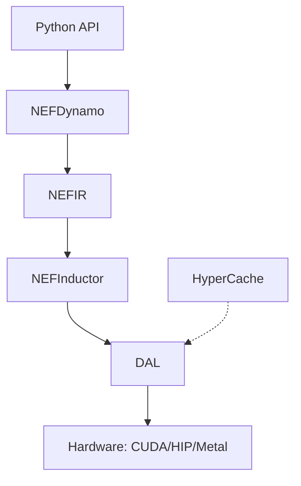

# NEF2 Architecture

NEF2 is structured as a hierarchical stack that abstracts hardware complexity while exposing raw performance primitives.

## The Multi-Layered Substrate

The system is divided into five distinct layers, each optimized for its specific role in the execution lifecycle.

### 1. NEFCore Runtime
The foundational layer responsible for tensor lifecycle management and execution graph dispatch.
- **Performance**: Written in C++17 and Rust.
- **Safety**: Rust-based memory safety for distributed components.
- **Portability**: Compiled as a native shared object for high-speed Python bindings.

### 2. Device Abstraction Layer (DAL)
The DAL provides a unified API for interacting with diverse hardware. It translates generic `TensorOps` into vendor-specific kernels.
- **NVIDIA**: Direct PTX and cuBLAS integration.
- **AMD**: HIP and hipBLAS support.
- **Apple**: Metal and MPSGraph acceleration.

### 3. HyperCache Memory Stack
A revolutionary approach to memory management that allows models to exceed the physical limits of VRAM.
- **Hot**: VRAM for active execution.
- **Warm**: System RAM for pre-fetched weights and KV-cache.
- **Cold**: NVMe storage for paged-out semantic memory.

### 4. NEF Compiler (Inductor)
The compiler transforms high-level Python models into optimized execution kernels.
- **Kernel Fusion**: Combines multiple operations into a single GPU kernel to reduce memory bandwidth.
- **Graph Capture**: Uses NEFDynamo to capture execution logic without manual intervention.

### 5. Agent-Native Infrastructure
Built-in primitives for building distributed systems of cooperating AI models.
- **Shared Tensor Bus**: Zero-copy data sharing between multiple processes.
- **Coordination Layer**: Managed lifecycle for multi-agent cognitive tasks.

## Data Flow Diagram

*Note: The actual site will feature interactive WebGL-based diagrams in this section.*
